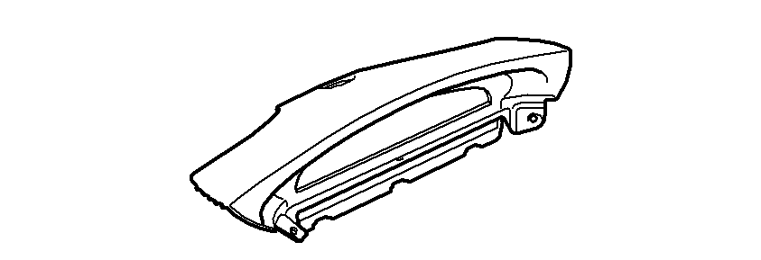

# SAAB SID
Repository to collect and share all known details of SAAB 9-3NG SID.

## What is SAAB SID?
SID stands for "SAAB Information Display". It is an display which shows various useful functions,informations and warnings to driver and passenger. It is wired to infotainment system and driver controls it via SIDC - SID control panel located left to infotainment.

## Hardware details

- 384x64px monochrome LCD screen, size 18.5cm x 3.5cm
- backlight devided into sections. Icon secion 64x64px with red or orange backlight, remaining secions are green only
- NTC resistor mounted directly on LCD glass to monitor its temperature
- 1-40000lux range ambient light sensor (photo diode) with light conductor to front side of SID
- alarm diode to indicate alarm state/mode
- 12-pin connector

# Protocol
Communication protocol is documented in [protocol.md](protocol.md) file.
